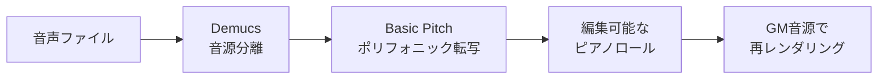

# bunri

あらゆる楽曲を編集可能なピアノロールに変換 — ローカル完結・プライバシー重視・オープンソース


[English version](README.md)

<!-- demo.gif -->


## なぜ bunri？

- **ローカル完結**: クラウド不要・サブスク不要。全てあなたのPC上で動作
- **オープンソース**: Apache-2.0。自由にフォーク・拡張・再配布
- **編集可能**: ステム分離だけでなく、MIDI的なノートデータとして編集・再配置・再レンダリング可能

## クイックスタート

### Docker（推奨）

```bash
docker compose up
```

`http://localhost:8000` をブラウザで開く。

### 手動セットアップ

```bash
# 1. バックエンド依存インストール
pip install -r requirements.txt

# 2. フロントエンド依存インストール
cd web-ui && npm ci && cd ..

# 3. フロントエンドビルド
make build

# 4. 起動
make web
```

## 仕組み



## 競合比較

| 機能 | bunri | Spleeter | LALAL.AI | GarageBand |
|---|---|---|---|---|
| ローカル実行 | yes | yes | no | yes |
| 無料・オープンソース | yes | yes | no | no |
| ピアノロール編集 | yes | no | no | yes |
| ポリフォニック転写 | yes | no | no | no |
| ステム分離 | yes | yes | yes | no |
| GM音源再レンダリング | yes | no | no | yes |
| Web UI | yes | no | yes | no |

## 機能

### DAW 画面 (`/`)

| 機能 | 内容 |
|---|---|
| タイムライン | トラック上にクリップを配置。ドラッグで移動、拍単位スナップ、WAV ファイルのドラッグ&ドロップ対応 |
| ピアノロール | トラックごとに独立。C2〜B6 の範囲でノート編集（ダブルクリックで追加、ドラッグで移動、Delete で削除） |
| オートメーション | ベジェ曲線によるパラメータ変化の描画・編集 |
| シンセサイザー | 基本波形 4 種（Sine / Square / Sawtooth / Triangle）、簡易楽器プリセット 6 種、GM 音源（FluidSynth 経由、84 音色） |
| ドラムマシン | 4 パターン（8ビート / 4つ打ち / ボサノバ / レゲエ）、小節数・音量指定可 |
| エフェクト | EQ（3バンド）/ コンプレッサー / リバーブ / ディレイ / ノーマライズ / ピッチシフト / タイムストレッチ |
| 楽曲完全解析 | Demucs 分離 → ポリフォニックピッチ検出 → トラック自動生成 → ピアノロール自動配置 |
| 単音メロディ解析 | pyin ピッチ検出で単音 WAV をピアノロールに変換 |
| AI アシスタント | 自然言語チャットでノート提案。ローカル（Ollama）またはクラウド（Claude）で動作 |
| トランスポート | BPM / 拍子 / 再生・停止・録音 / メトロノーム / シークバー |
| 録音 | マイク入力からトラックに直接録音 |
| プロジェクト保存・読込 | JSON 形式で保存・復元 |
| WAV 書き出し | 全トラックをオフラインミックスダウンして WAV エクスポート |

### ツール画面 (`/tools`)

| タブ | 内容 |
|---|---|
| 完全分解 | Demucs 6 ステム分離 → ポリフォニックピッチ検出 → 楽器推定 → JSON 出力 |
| 音源分離 | Demucs による 2/4/6 ステム分離 |
| 解析 | 周波数帯域分布、推定楽器構成、テンポ推定 |
| 編集 | トリム / カット / 範囲コピー / 無音挿入 / ループ |
| エフェクト | EQ / コンプレッサー / リバーブ / ディレイ / 音量 / フェード / パン / リバース / ピッチシフト / タイムストレッチ |
| 一括編集 | 複数ファイルに同一操作を適用 |
| 音源合成 | 2 つの WAV をオーバーレイミックス |
| 変換 | MP4/AVI/MKV 等 → WAV / MP3 変換（ffmpeg 使用） |
| WAV 最適化 | サンプルレート変換 + ビット深度変換（TPDF ディザリング）で容量削減 |

### ヘルプ画面 (`/help`)

操作ガイド、画面構成の説明、キーボードショートカット一覧を掲載。

## ロードマップ

- [ ] MIDI インポート / エクスポート
- [ ] VST プラグインサポート
- [ ] リアルタイムコラボレーション
- [ ] モバイル対応
- [ ] より多くの AI モデルへの対応

## コントリビュート

コントリビュート歓迎です！まずissueで議論してからPRを送ってください。

## ライセンス

[Apache-2.0](LICENSE)

## 詳細なDAW機能ドキュメント

[DAW機能の詳細はこちら](docs/daw-features.md)
