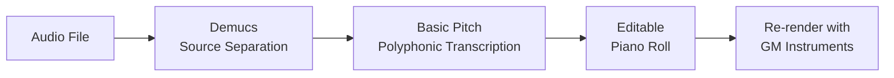

# bunri

> Turn any song into an editable piano roll — locally, privately, open source.

[](LICENSE)
[](https://python.org)
[](docker-compose.yml)

[日本語版はこちら](README.ja.md)


*(demo coming soon)*

## Why bunri?

- **Local** — Runs entirely on your machine. No cloud, no subscription, no data leaves your computer.
- **Open** — Apache-2.0 licensed. Fork it, extend it, ship it.
- **Editable** — Not just stems. Actual MIDI-like notes you can edit, rearrange, and re-render with any instrument.

## Quick Start

### Docker (recommended)

```bash
docker compose up
# Open http://localhost:8000
```

### Manual Install

```bash
# Backend
pip install -r requirements.txt

# Frontend
cd web-ui && npm ci && npm run build && cd ..

# Start
python run_web.py
# Opens http://127.0.0.1:8000
```

## How It Works



1. **Separate** — Demucs splits your song into 6 stems (vocals, drums, bass, guitar, piano, other)
2. **Transcribe** — Spotify's Basic Pitch detects every note in each stem, including chords
3. **Edit** — Notes appear on a piano roll where you can move, resize, add, or delete them
4. **Re-render** — Play back with your choice of 84 GM instruments, or export as WAV

## Comparison

| Feature | bunri | Moises.ai | RipX DAW | Spleeter GUI | Basic Pitch CLI |
|---|:---:|:---:|:---:|:---:|:---:|
| Open source | Yes | No | No | Yes | Yes |
| Offline / local | Yes | No | Yes | Yes | Yes |
| Stem separation | 6 stems | 5 stems | 6 stems | 4 stems | No |
| Polyphonic transcription | Yes | No | Yes | No | Yes |
| Editable piano roll | Yes | No | Yes | No | No |
| Built-in DAW | Yes | Limited | Yes | No | No |
| Docker support | Yes | N/A | No | No | No |
| AI composition assistant | Yes | No | No | No | No |
| Price | Free | $4-25/mo | $200+ | Free | Free |

## Features

- **Song to Piano Roll** — Upload any audio file, get editable notes on a timeline in one click
- **Source Separation** — Demucs 6-stem (vocals / drums / bass / guitar / piano / other)
- **AI Music Assistant** — Describe what you want in natural language, get note suggestions (Ollama local or Claude cloud)
- **Synth & Drum Machine** — 4 waveforms, 6 instrument presets, GM soundfont, 4 drum patterns
- **Effects** — EQ, compressor, reverb, delay, pitch shift, time stretch
- **WAV Optimizer** — Reduce file size with high-quality resampling + TPDF dithering
- **Project Save/Load/Export** — JSON projects, WAV mixdown export

## Roadmap

- [x] Basic Pitch integration (polyphonic transcription)
- [x] Docker support
- [x] AI composition assistant (Ollama + Claude)
- [ ] MIDI export
- [ ] VST plugin support
- [ ] Real-time collaboration
- [ ] Mobile-responsive UI

## Development

```bash
make test              # Run all tests (frontend + backend)
make lint              # ESLint + ruff
cd web-ui && npx tsc --noEmit  # Type check
```

See [docs/daw-features.md](docs/daw-features.md) for detailed architecture and API documentation.

## Contributing

We welcome contributions! Please open an issue first to discuss what you'd like to change.

## License

[Apache-2.0](LICENSE)
